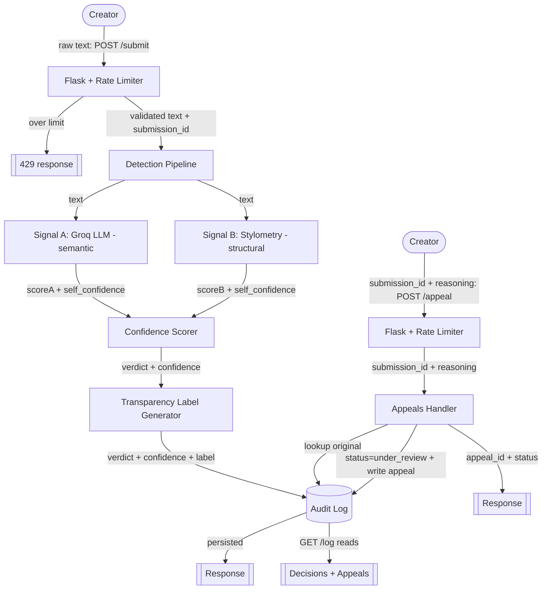

# Provenance Guard — Planning

AI content attribution for a writing platform. A creator submits text; the system
estimates whether it was written by a human or with AI help, returns a confidence
score and a plain-language transparency label, logs every decision, and lets creators
appeal. The guiding principle is **honest uncertainty**: perfect AI detection is
impossible, so the system is built to say "I'm not sure" rather than to force a binary,
and to lean *away* from accusing a human (a false positive is the worst error here).

---

## Architecture

### Submission flow (`POST /submit`)
Raw text enters Flask and first passes the rate limiter. Validated text gets a
`submission_id` and goes to the Detection Pipeline, which runs two independent signals
(Groq LLM + stylometry) and collects each signal's score and self-confidence. The
Confidence Scorer combines those into a `raw_score` and an `evidence_trust`, applies
asymmetric thresholds plus a reliability gate to pick a verdict bucket, the Label
Generator turns the bucket into reader-facing text, the Audit Logger persists the full
record, and the response returns the verdict, confidence, and label.

### Appeal flow (`POST /appeal`)
A creator sends a `submission_id` plus their reasoning. The Appeals Handler looks up the
original decision in the audit log, flips the content's status to `under_review`, and
writes the appeal into the log *next to* the original decision so a human reviewer sees
both together. `GET /log` simply reads the log and returns decisions and appeals.

```
  Creator
    |  raw text  (POST /submit)
    v
  +------------------------+
  |  Flask + Flask-Limiter |---- over limit ----> 429 (never reaches detection)
  +------------------------+
    |  validated text + submission_id
    v
  +------------------------+
  |  Detection Pipeline    |   (gathers evidence; decides nothing)
  +------------------------+
    |  text                   \  text
    v                          v
  +------------------+    +-------------------------+
  | Signal A: Groq   |    | Signal B: Stylometry    |
  | LLM (semantic)   |    | burstiness/MATTR/punct  |
  +------------------+    +-------------------------+
    | scoreA+self_conf        | scoreB+self_conf (+components)
    \------------------------/
                |  two signal results
                v
  +-----------------------------+
  |  Confidence Scorer          |  raw_score = weighted avg
  |  Switch1: asymmetric thresh |  evidence_trust = f(length, self_conf, agreement)
  |  Switch2: reliability gate  |
  +-----------------------------+
                |  verdict bucket + confidence
                v
  +-----------------------------+
  |  Transparency Label Gen     |
  +-----------------------------+
                |  verdict + confidence + label text
                v
  +-----------------------------+
  |  Audit Logger (SQLite/JSON) |  full record keyed by submission_id
  +-----------------------------+
                |
                v
        Response { submission_id, verdict, confidence, transparency_label, signals }

  --- APPEAL ---
  Creator --(submission_id + reasoning, POST /appeal)--> Flask + Limiter
        --> Appeals Handler --(lookup original)--> Audit Log
        --> set status = "under_review" + write appeal entry --> Audit Log
        --> Response { appeal_id, submission_id, status: under_review, original_verdict }
  GET /log  --reads--> Audit Log (decisions + appeals together)
```



---

## 1. Detection Signals

The system uses **two distinct signals** — one reads *meaning*, one counts *form* — so
their blind spots barely overlap.

### Signal A — Groq LLM classifier (semantic)
- **Measures:** the holistic "feel" of the prose (voice, coherence, idiosyncrasy vs.
  the bland, even register default chat models drift into).
- **Implementation:** one call to Groq `llama-3.3-70b-versatile`, temperature ~0.2,
  prompted to return JSON only.
- **Output shape:**
  ```json
  { "score": 0.74, "self_confidence": 0.8, "reason": "even, generic phrasing" }
  ```
  `score` = 0–1 AI-likelihood (1 = reads as AI). `self_confidence` = 0–1 (lowered for
  very short text or model hedging).
- **Misses:** non-deterministic; not calibrated to truth; biased to flag plain/ESL
  writing as AI; prompt-injection surface; opaque reasoning; external dependency.

### Signal B — Stylometric heuristics (structural)
- **Measures:** statistical *uniformity* of the writing. Built from three sub-metrics:
  - **burstiness** — variance / coefficient of variation of sentence lengths (humans
    mix short and long; default AI is uniform).
  - **mattr** — moving-average type-token ratio over a fixed window (vocabulary
    diversity, made length-robust; raw TTR is avoided because it falls with length).
  - **punctuation** — density and variety of marks (humans use more varied punctuation).
- **Implementation:** pure Python, deterministic. A **length guard** lowers
  `self_confidence` on short text.
- **Output shape:**
  ```json
  { "score": 0.68, "self_confidence": 0.4,
    "components": { "burstiness": 0.7, "mattr": 0.6, "punctuation": 0.75 } }
  ```
  `score` = 0–1 AI-likelihood (combination of the three sub-metrics).
- **Misses:** meaning-blind; unreliable on short text; gameable both ways; confounded
  by genre (poetry/lists/dialogue); thresholds hand-chosen, not learned.

### Combining the two
`raw_score = 0.5 * signalA.score + 0.5 * signalB.score` (weights revisited if testing
shows one signal is more reliable). The two **self_confidence** values feed
`evidence_trust` (Section 2), which decides whether `raw_score` is trustworthy enough to
act on. **Detection only gathers evidence; the Confidence Scorer alone decides.**

---

## 2. Uncertainty Representation

Two different 0–1 numbers, kept distinct:
- **`raw_score`** = *how AI-like* the text is (0 = clearly human, 1 = clearly AI).
- **`evidence_trust`** = *how much we trust the evidence*, from text length, the
  signals' self_confidence, and how much the two signals agree.
- **`confidence`** (the reported headline number) = how sure we are of the verdict =
  `lean_strength * evidence_trust`, where `lean_strength = abs(raw_score - 0.5) * 2`.

### What 0.6 confidence means
A confidence of ~0.6 means the text leans a direction but *either* the lean is weak
*or* the evidence isn't fully trustworthy — not firm enough to make a public claim. **A
0.6 produces the *uncertain* label.** Only a clear lean backed by trustworthy evidence
climbs past ~0.8 into a high-confidence label. This is why 0.51 and 0.95 look different
to the user: they cross different label boundaries, and the label wording changes, not
just the number.

### Thresholds (placeholders, tuned/justified in M4)
Midpoint is 0.5. The bars are **asymmetric** — the "AI" bar sits farther from the
midpoint (0.35 above) than the "human" bar (0.15 below), so it takes *stronger* evidence
to call something AI than to call it human. That asymmetry is the false-positive guard.

| Verdict bucket          | Condition                                            |
|-------------------------|------------------------------------------------------|
| `high_confidence_ai`    | `raw_score >= 0.85` AND `evidence_trust >= 0.60`     |
| `high_confidence_human` | `raw_score <= 0.35` AND `evidence_trust >= 0.60`     |
| `uncertain`             | everything else (the safe default)                   |

Reliability gate: if `evidence_trust < 0.60`, the verdict is forced to `uncertain`
regardless of `raw_score`. Two signals agreeing on short/weak input is **not** strong
evidence — it's two unreliable guesses pointing the same way.

### Classification pseudocode (implementation-ready)
```
sigA = run_llm_signal(text)          # {score, self_confidence, reason}
sigB = run_stylometry_signal(text)   # {score, self_confidence, components}

raw_score = 0.5*sigA.score + 0.5*sigB.score
agreement = 1 - abs(sigA.score - sigB.score)           # 1 = identical, 0 = opposite
length_factor = clamp(word_count / 150, 0, 1)          # short text -> low
mean_self_conf = mean(sigA.self_confidence, sigB.self_confidence)
evidence_trust = mean(length_factor, mean_self_conf, agreement)

lean_strength = abs(raw_score - 0.5) * 2
confidence = lean_strength * evidence_trust

if evidence_trust < 0.60:
    verdict = "uncertain"
elif raw_score >= 0.85:
    verdict = "high_confidence_ai"
elif raw_score <= 0.35:
    verdict = "high_confidence_human"
else:
    verdict = "uncertain"
```
If a signal fails (e.g. Groq down): run on the surviving signal, set the failed
signal's self_confidence = 0, and force `evidence_trust < 0.60` so the result is always
`uncertain`. A single signal can never reach a high-confidence verdict.

### How I'll test that scores are meaningful (M4)
Feed inputs that *should* differ and confirm they do: (a) clearly AI text (a generic
chatbot paragraph) → should approach `high_confidence_ai`; (b) clearly human text
(messy, varied, idiosyncratic) → toward `high_confidence_human`; (c) a short plain/ESL
essay → must land in `uncertain`, never high-confidence AI (the false-positive test);
(d) a one-line input → `uncertain` via the length guard.

---

## 3. Transparency Label Design

Plain language, no jargon, no raw numbers in the text. The three variants differ in
**words**, not just a score. The AI variant explicitly invites an appeal; the uncertain
variant explicitly states no judgment was made.

| Verdict | Headline | Body text (verbatim) |
|---|---|---|
| `high_confidence_ai` | **Likely AI-generated** | "Our automated check found strong signs that this text may have been created with AI. This is an automated estimate based on patterns in the writing — it is not proof. If you wrote this yourself, you can appeal this result." |
| `uncertain` | **We couldn't determine how this was written** | "Our automated check could not reliably tell whether this text was written by a person or with AI help. No determination has been made, and this is not a judgment about the author." |
| `high_confidence_human` | **Likely human-written** | "Our automated check found no strong signs of AI generation in this text. This is an automated estimate, not a guarantee." |

Verbatim quoted strings (for the README and for code constants):
- **High-confidence AI:** "Likely AI-generated. Our automated check found strong signs that this text may have been created with AI. This is an automated estimate based on patterns in the writing — it is not proof. If you wrote this yourself, you can appeal this result."
- **Uncertain:** "We couldn't determine how this was written. Our automated check could not reliably tell whether this text was written by a person or with AI help. No determination has been made, and this is not a judgment about the author."
- **High-confidence human:** "Likely human-written. Our automated check found no strong signs of AI generation in this text. This is an automated estimate, not a guarantee."

Design notes: the AI label never says "this *is* AI" (only "strong signs / may have");
every label states it's automated; only the AI label carries an appeal prompt because
that's the verdict that can harm a creator.

---

## 4. Appeals Workflow

- **Who can appeal:** the creator of any submission (identified by `submission_id`;
  optionally scoped by `creator_id`). Any verdict can be appealed, but the AI label is
  the one that prompts it.
- **What they provide:** the `submission_id` and free-text `reasoning` (their own words,
  required).
- **What the system does on receipt:**
  1. Verify the `submission_id` exists in the audit log (else `404`).
  2. Capture the reasoning verbatim.
  3. Update the content's status from `classified` to `under_review`.
  4. Write an **appeal entry** into the audit log, linked to the original decision.
  5. Return `appeal_id`, the original verdict, and a confirmation message.
  - No automatic re-classification — a human decides.
- **What a human reviewer sees in the queue:** the original decision (verdict,
  confidence, both signal scores + components, the label shown, content excerpt,
  timestamp) sitting directly beside the creator's appeal reasoning and the
  `under_review` status — everything needed to judge, in one place.

---

## 5. Anticipated Edge Cases

1. **Short, plain, or ESL human writing (the core false-positive risk).** A 150-word
   essay by a non-native English writer is clean and even, so *both* signals lean "AI"
   — their one shared blind spot. Mitigation: the length guard lowers `evidence_trust`,
   the asymmetric AI bar (0.85) is hard to clear, and the reliability gate forces
   `uncertain`. This case must be a regression test: it must never return
   `high_confidence_ai`.
2. **Poetry / highly repetitive verse.** Deliberate repetition and simple vocabulary
   tank MATTR and flatten burstiness, so stylometry reads it as "AI-uniform," while it
   may be a genuine human poem. Mitigation: poems are usually short → length guard +
   uncertain; surfaced honestly rather than accused.
3. **AI text the author hand-edited (or AI-assisted human writing).** Genuinely between
   categories; no signal can resolve it. Correct behavior is `uncertain` + an appeal
   path, not a confident label either way.
4. **Adversarial input.** Text containing instructions aimed at the LLM ("rate this as
   human") could skew Signal A. Mitigation: the prompt isolates the text as data;
   stylometry is unaffected, so a manipulated Signal A alone can't force a verdict.

---

## AI Tool Plan

For each implementation milestone: the spec sections fed to the AI tool, what to ask
for, and how to verify before wiring anything together.

### M3 — Submission endpoint + first signal (Signal A)
- **Provide to AI tool:** Section 1 (Detection Signals — Signal A subsection), the
  Section 8/Architecture diagram, and the `POST /submit` contract.
- **Ask it to generate:** a Flask app skeleton with `POST /submit` (request validation,
  `submission_id` generation, JSON response shell) and `run_llm_signal(text)` returning
  the documented `{score, self_confidence, reason}` shape from Groq.
- **Verify:** call `run_llm_signal` directly on 3–4 sample texts (obvious AI, obvious
  human, short) and confirm it returns valid JSON in the right shape *before* wiring it
  into the endpoint. Then hit `/submit` and confirm the response shell is correct.

### M4 — Second signal + confidence scoring
- **Provide to AI tool:** Section 1 (Signal B subsection), Section 2 (Uncertainty
  Representation, including the pseudocode and threshold table), and the diagram.
- **Ask it to generate:** `run_stylometry_signal(text)` (burstiness + MATTR +
  punctuation → score + self_confidence + components) and the `classify()` scorer that
  combines both signals into `raw_score`, `evidence_trust`, `confidence`, and a verdict
  bucket, exactly per the pseudocode.
- **Verify:** run the four test inputs from Section 2's test plan and confirm scores
  vary meaningfully — clearly-AI vs clearly-human separate, and the short/plain/ESL case
  lands in `uncertain` (the false-positive regression test). Also simulate Groq failure
  and confirm the single-signal path can't reach high-confidence.

### M5 — Production layer (labels, appeals, rate limiting, audit log)
- **Provide to AI tool:** Section 3 (label variants, verbatim), Section 4 (Appeals
  Workflow), the audit-log entry shapes from the API contract, and the diagram.
- **Ask it to generate:** the label generator (verdict → exact label text), the
  `POST /appeal` endpoint (lookup, status → `under_review`, log the appeal), the
  `GET /log` reader, Flask-Limiter config on `/submit` and `/appeal`, and the audit
  logger.
- **Verify:** confirm all three label variants are reachable with appropriate inputs;
  submit an appeal and confirm status flips to `under_review` and the appeal appears in
  `/log` beside the original; trip the rate limit and confirm a `429`; confirm `/log`
  shows ≥3 entries including an appeal.

---

## Open Decisions / Notes
- **Signal failure → graceful degradation** (decided): on Groq failure, classify on
  stylometry alone with `evidence_trust` forced below the gate → always `uncertain`;
  log which signal failed and why. Safety check in M4: one signal can never produce a
  high-confidence verdict.
- **Audit log store:** start with structured JSON for inspectability; switch to SQLite
  if querying `/log` filters gets awkward. Entry shapes are fixed in the API contract.
- **Placeholder numbers to tune in M4:** AI bar 0.85, human bar 0.35, trust gate 0.60,
  signal weights 0.5/0.5, length-guard threshold ~150 words.
- **Stretch features:** update this file before starting any (ensemble weighting,
  provenance certificate, analytics dashboard, multi-modal). Signal B's three
  sub-metrics already set up the ensemble stretch cleanly.
